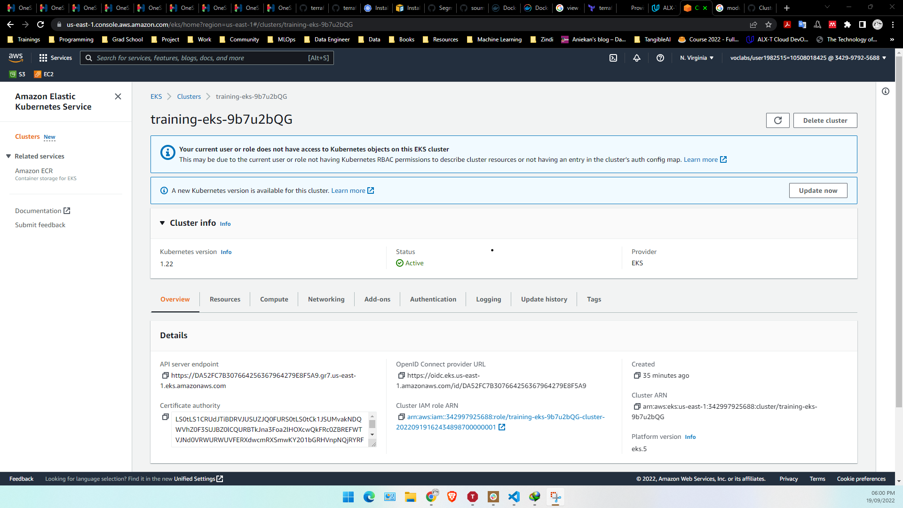
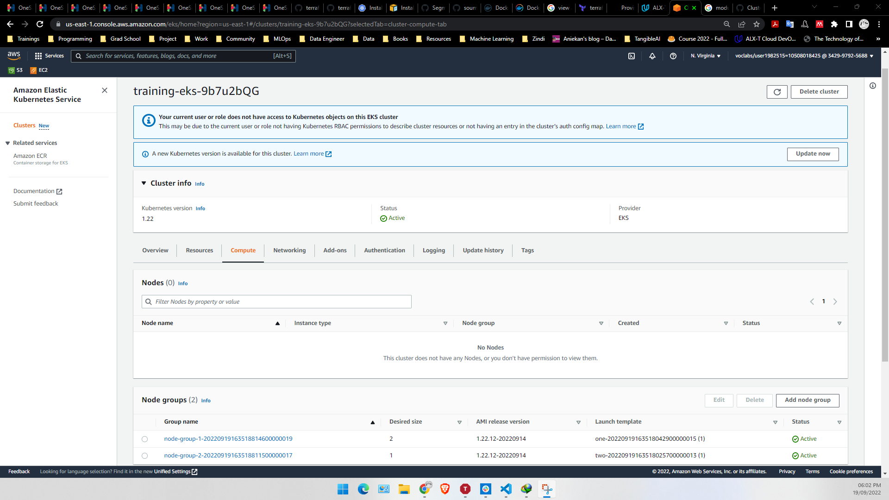

# Deploy your AWS EKS cluster with Terraform

The purpose of this tutorial is to create an EKS cluster with Terraform. 

## Pre-requisite:

- Get an AWS free trial account
- Install Terraform

```
brew install terraform
```

- Install AWSCLI 2.0

```
brew install awscli
```

- Install AWS IAM Authenticator

```
brew install aws-iam-authenticator
```

- Install WGET

```
brew install wget
```

- Install Kubectl

```
brew install kubernetes-cli
```


## Setting up AWS IAM users for Terraform

The first thing to set up is your Terraform. We will create an AWS IAM users for Terraform.

In your AWS console, go to the IAM section and create a user named “SudoAccess”. Then add your user to a group named “SudoAccessGroup”. 
Attaches to this group the following rights:

- AdministratorAccess
- AmazonEKSClusterPolicy

After these steps, AWS will provide you a Secret Access Key and Access Key ID. 
Save them preciously because this will be the only time AWS gives it to you.

In your own console, create a ~/.aws/credentials file and put your credentials in it:


```
[default]
aws_access_key_id=***********
aws_secret_access_key=****************************
```

## Creating Config file

```
cat config
[default]
region=us-east-1
```

## Cloning the Repository

```
git clone https://github.com/IzicTemi/hamoye_stage_d_lab_5.git
```

In here, you will find six files used to provision a VPC, security groups and an EKS cluster. The final product should be similar to this:


- vpc.tf provisions a VPC, subnets and availability zones using the AWS VPC Module. A new VPC is created for this guide so it doesn't impact your existing cloud environment and resources.

- security-groups.tf provisions the security groups used by the EKS cluster.

- eks-cluster.tf provisions all the resources (AutoScaling Groups, etc...) required to set up an EKS cluster in the private subnets and bastion servers to access the cluster using the AWS EKS Module.

- On line 14, the AutoScaling group configuration contains three nodes.

- outputs.tf defines the output configuration.

- versions.tf sets the Terraform version to at least 1.0. It also sets versions for the providers used in this sample.

## Initialize Terraform workspace

```
> terraform init

Initializing modules...
Downloading registry.terraform.io/terraform-aws-modules/eks/aws 18.29.0 for eks...
- eks in .terraform/modules/eks
- eks.eks_managed_node_group in .terraform/modules/eks/modules/eks-managed-node-group
- eks.eks_managed_node_group.user_data in .terraform/modules/eks/modules/_user_data
- eks.fargate_profile in .terraform/modules/eks/modules/fargate-profile
Downloading registry.terraform.io/terraform-aws-modules/kms/aws 1.0.2 for eks.kms...
- eks.kms in .terraform/modules/eks.kms
- eks.self_managed_node_group in .terraform/modules/eks/modules/self-managed-node-group
- eks.self_managed_node_group.user_data in .terraform/modules/eks/modules/_user_data
Downloading registry.terraform.io/terraform-aws-modules/vpc/aws 2.6.0 for vpc...
- vpc in .terraform/modules/vpc

Initializing the backend...

Initializing provider plugins...
- Finding hashicorp/cloudinit versions matching ">= 2.0.0"...
- Finding hashicorp/aws versions matching ">= 3.72.0"...
- Finding hashicorp/random versions matching "~> 2.1"...
- Finding hashicorp/local versions matching "~> 1.2"...
- Finding hashicorp/null versions matching "~> 2.1"...
- Finding hashicorp/template versions matching "~> 2.1"...
- Finding hashicorp/tls versions matching ">= 3.0.0"...
- Finding hashicorp/kubernetes versions matching ">= 2.10.0"...
- Installing hashicorp/null v2.1.2...
- Installed hashicorp/null v2.1.2 (signed by HashiCorp)
- Installing hashicorp/template v2.2.0...
- Installed hashicorp/template v2.2.0 (signed by HashiCorp)
- Installing hashicorp/tls v4.0.2...
- Installed hashicorp/tls v4.0.2 (signed by HashiCorp)
- Installing hashicorp/kubernetes v2.13.1...
- Installed hashicorp/kubernetes v2.13.1 (signed by HashiCorp)
- Installing hashicorp/cloudinit v2.2.0...
- Installed hashicorp/cloudinit v2.2.0 (signed by HashiCorp)
- Installing hashicorp/aws v4.31.0...
- Installed hashicorp/aws v4.31.0 (signed by HashiCorp)
- Installing hashicorp/random v2.3.1...
- Installed hashicorp/random v2.3.1 (signed by HashiCorp)
- Installing hashicorp/local v1.4.0...
- Installed hashicorp/local v1.4.0 (signed by HashiCorp)

Terraform has created a lock file .terraform.lock.hcl to record the provider
selections it made above. Include this file in your version control repository
so that Terraform can guarantee to make the same selections by default when
you run "terraform init" in the future.

Terraform has been successfully initialized!

You may now begin working with Terraform. Try running "terraform plan" to see
any changes that are required for your infrastructure. All Terraform commands
should now work.

If you ever set or change modules or backend configuration for Terraform,
rerun this command to reinitialize your working directory. If you forget, other
commands will detect it and remind you to do so if necessary.
```

```
> terraform plan
```
- View sample output in [tfplan.txt](tfplan.txt)

```
> terraform apply

Apply complete! Resources: 62 added, 0 changed, 0 destroyed.

Outputs:

cluster_endpoint = "https://****************.gr7.us-east-1.eks.amazonaws.com"
cluster_name = "training-eks-**********"
cluster_security_group_id = "************"
region = "us-east-1"
```

## Configure kubectl

Now that you've provisioned your EKS cluster, you need to configure kubectl. Customize the following command with your cluster name and region, the values from Terraform's output. It will get the access credentials for your cluster and automatically configure kubectl.


```
aws eks --region us-east-2 update-kubeconfig \
  --name training-eks-**********
```

## List Provsioned Resources
```
touch created_resources.txt
echo $(aws resourcegroupstaggingapi get-resources --tag-filters Key=Environment,Values=training) > created_resources.txt
```

View sample output in [created_resources.txt](created_resources.txt)

Navigate to EKS on the AWS Console to view cluster





